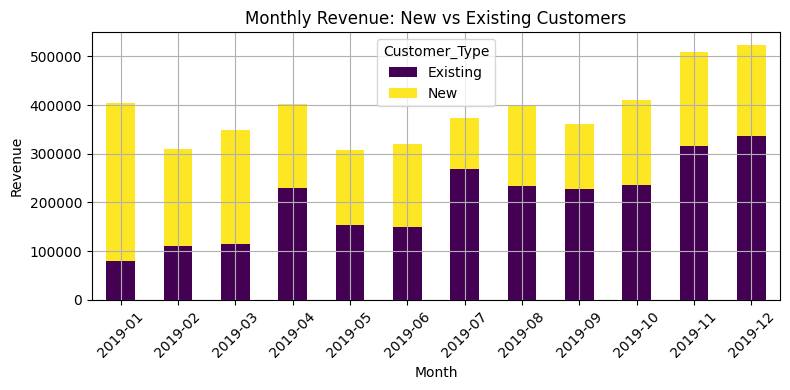
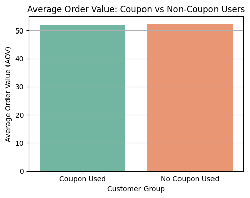

E-commerce Marketing and Sales Analysis

🧠 Business Case Overview

The e-commerce company aims to leverage data-driven insights to enhance customer acquisition, retention, and revenue optimization. This analysis explores key business questions using transaction, customer, coupon, marketing, and tax data from the year 2019. It applies exploratory data analysis (EDA), statistical methods, and business logic to generate actionable recommendations.

Dataset file: https://github.com/Parames0303/E-commerce-Marketing-and-sales-analysis/blob/main/DAV%20Business%20case-20250508-Data

📊 Dataset Summary

Period Covered: Jan 1, 2019 – Dec 31, 2019

Data Sources:

Online_Sales.csv (transaction-level order data)

Customers_Data.csv (customer demographics)

Discount_Coupon.csv (monthly coupon rules)

Marketing_Spend.csv (day-wise marketing expenses)

Tax_Amount.csv (product-level tax details)

✅ Summary of Findings by Business Question

1. 🔺 Identify the months with highest and lowest acquisition rates

Here is the analysis result visualization on the aquisition rate
### 📈 Monthly Customer Acquisition

Highest acquisition: January (215 new customers)

Lowest acquisition: November (68 new customers)

Recommendation: Replicate January's success with year-start campaigns. Use offers and referral programs to lift Q4.

2. 📅 Do certain months consistently perform better?

Strong Q1 performance: Jan, Mar, Apr.

Weak Q4: Sep–Nov.

Strategy: Scale Q1 campaigns, retarget dormant users in Q4, and smooth acquisition through always-on efforts.

3. 📈 Identify retention highs and lows

Strong retention: July, Oct–Dec

Weak retention: Feb–Apr

Strategy: Extend retention campaigns into low-months with reminders, loyalty rewards, and behavior-based offers.

4. 🔄 High-retention behavior analysis

Retention > 59% in top 5 months (Nov, Jul, Sep, Oct, Dec)

Driven by: Promotions, campaign continuity, higher coupon usage, popular categories

Strategy: Trigger-based repurchase offers, sequenced campaigns, and loyalty programs

5. 👥 New vs Existing Customer Revenue

New customers dominate Jan–Mar

Existing customers dominate Apr–Dec

Insight: Retention is strong; acquisition efforts needed in mid-to-late year.

6. 💸 Coupon Usage vs Revenue Impact
   

Coupon Users: 17,904 | Non-Coupon Users: 35,020

P-value = 0.304 → No significant difference in AOV

Insight: Coupons useful for engagement, but don't raise order value.

Strategy: Use threshold-based, behavior-triggered coupons.

7. 🏆 Top Performing Products

Top SKUs contribute majority of revenue

Success driven by: High sales volume, coupon usage, key categories

Inventory Action: Prioritize stock levels of high movers

Promo Strategy: Bundle top items, pair with coupons in slow months

8. 📈 Marketing Spend vs Revenue

Some months (e.g., January and October) show high ROI from marketing.

Other months (e.g., April, June) show lower return despite similar spend.

Recommendation: Reallocate budget to high-performing campaigns and months with higher responsiveness.

9. 📊 Evaluate Marketing Effectiveness

Campaign ROI varies monthly.

Insight: Online spend shows stronger correlation with revenue.

Strategy: Emphasize digital channels. Use attribution models to refine future campaigns.

10. 🧱 Customer Segmentation with RFM

Segments: Premium, Gold, Silver, Standard based on Recency, Frequency, Monetary score.

Findings: Premium customers have highest AOV and lifetime value.

Strategy: Tailor loyalty perks for Premium, nurture Silver/Standard via engagement offers.

11. 💰 Segment Revenue Contribution

Premium segment drives ~40% of total revenue

Silver and Standard have volume but low yield.

Strategy: Focus retention on Premium/Gold and run reactivation campaigns for Silver/Standard.

12. ⏳ Cohort-Based Retention

Early cohorts (Jan–Mar) showed stronger long-term retention.

Later cohorts (Jul–Sep) dropped off faster.

Strategy: Improve onboarding + early engagement for new cohorts.

13. 🧮 Customer Lifetime Value (CLTV) by Acquisition Month

CLTV highest for Jan and Oct cohorts.

Insight: Strong campaigns and product mix drive higher value.

Strategy: Align acquisition efforts with months that bring long-term returns.

14. 📉 Coupon vs No-Coupon: Transaction Value

Statistical test (p=0.304): No significant difference in AOV.

Insight: Coupons don't drive bigger orders — focus on targeted usage.

Recommendation: Restrict coupons to cart abandoners or bulk incentives.

15. 👥 Purchase Behavior by Demographics

Significant variation by location and gender.

Some regions had higher AOV and order frequency.

Strategy: Use personalized campaigns by region + target age groups showing interest.

16. 🕒 Customer Tenure vs Purchase Frequency

Strong positive correlation.

Older customers purchase more often.

Recommendation: Reward long-term loyalty with exclusive offers and early access.

17. 🚚 Delivery Charges vs Order Behavior

Higher delivery charges slightly reduce order size/frequency.

Insight: Customers react to high delivery fees.

Strategy: Offer free shipping threshold or discounted delivery during off-peak.

18. 🧾 Taxes & Delivery Impact on Spending

High tax categories had slightly lower purchase volumes.

Strategy: Adjust pricing bundles to absorb tax or delivery during price-sensitive periods.

19. 📅 Seasonal Sales by Category & Location

Seasonal peaks observed in categories like Fashion and Electronics.

Strategy: Align stock and campaigns with expected seasonal surges.

20. 📆 Daily Sales Trends

Consistent lows on Mondays and highs on weekends.

Strategy: Offer Monday flash sales or bundle discounts to improve weekday volume.

📁 Repository Structure

📦 E-commerce-Marketing-Case

├── Scaler_business_use_case_1.ipynb        # Full code and analysis

├── README.md                               # Problem summary + insights (this file)

├── plots/                                  # Visuals exported from notebook (optional)

├── data/                                   # Original datasets

📌 Tools Used

Python (Pandas, NumPy, Seaborn, Matplotlib, Scipy)

Jupyter Notebook

🧩 Key Business Recommendations

Replicate high-acquisition campaigns across quarters

Use retargeting and behavior-triggered offers to improve retention

Optimize coupon strategy with smarter rules and timing

Adjust inventory and promotions based on product performance

Focus on boosting acquisition in Q3–Q4 to balance strong retention

Reallocate marketing budgets based on historical ROI by channel/month

Design customer segment-specific engagement flows for growth

For full details, refer to the notebook .
